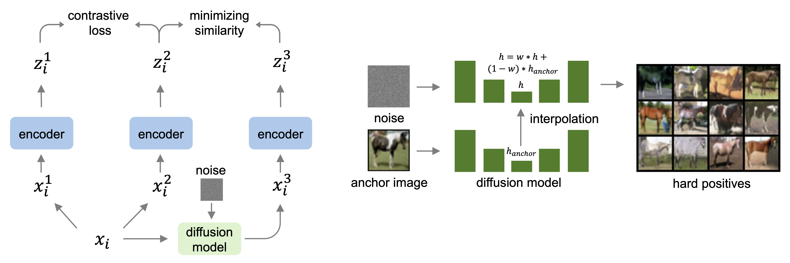
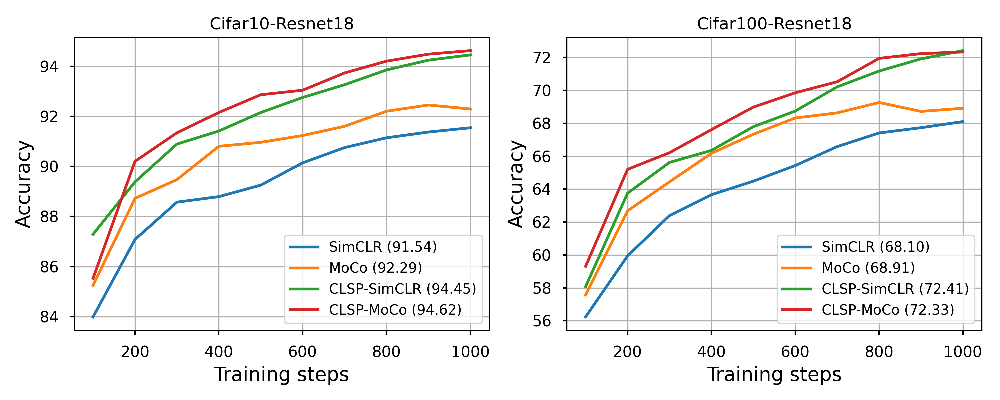

## Contrastive Learning with Synthetic Positives

This is a PyTorch implementation of [CLSP](http://arxiv.org/abs/2408.16965) paper.

<p align="center">
  
</p>

### :rocket: Main Results

- The linear evaluation accuracy we get during training is similar to the offline setting. 
- For Offline kNN evaluation, we do a grid search on k and report the best top1 accuracy.
- Accuracy might be different from the number in the paper because of random initialization.

### Cifar10

| Method       | Backbone | Epochs | Offline Acc@1|  Offline kNN   | Tensorboard    | Checkpoint |
|--------------|--------|:------:|:--------------:|:--------------:|:--------------:|:----------:|
| CLSP-SimCLR  | ResNet18 |  1000  | 94.45        | 94.10 | [:running:](./runs_release/simclr_clsp_cifar10_resnet18_bs-1024_temp-0.2_2024-08-24_15-39-29/)      |      [:link:](https://drive.google.com/file/d/1eQbezpJWeI4dy65iuXeNU5_iCtY97YmB/view?usp=sharing)      |
| CLSP-MoCo    | ResNet18 |  1000  | 94.62        | 94.01 | [:running:](./runs_release/moco_clsp_cifar10_resnet18_bs-512_temp-0.2_2024-08-24_22-14-18/)         |      [:link:](https://drive.google.com/file/d/1u-XJIGOprherVrdDe_-61uZoV6WiCfN2/view?usp=sharing)      |
| CLSP-SimCLR  | ResNet50 |  1000  | 95.57        | 95.14 | [:running:](./runs_release/simclr_clsp_cifar10_resnet50_bs-1024_temp-0.2_2024-08-28_20-25-41/)      |      [:link:](https://drive.google.com/file/d/1oPn9kqFSC0LXVBvpdbf6dW4Qkgb5mtvE/view?usp=sharing)      |
| CLSP-MoCo    | ResNet50 |  1000  | 96.04        | 95.33 | [:running:](./runs_release/moco_clsp_cifar10_resnet50_bs-512_temp-0.2_2024-08-29_12-48-04/)         |      [:link:](https://drive.google.com/file/d/1GpctLxzHGFlsLdlyvRaxXGkksSbcw08a/view?usp=sharing)      |
| SimCLR       | ResNet18 |  1000  | 91.45        | 91.05 | [:running:](./runs_release/simclr_cifar10_resnet18_bs-1024_temp-0.2_2024-08-13_16-06-34/)           |      [:link:](https://drive.google.com/file/d/1cpIA_0_pAppuZJ2C3ZmoBdelIfHh3hfC/view?usp=sharing)      |
| MoCo         | ResNet18 |  1000  | 92.29        | 91.74 | [:running:](./runs_release/moco_cifar10_resnet18_bs-512_temp-0.2_2024-08-16_13-56-02/)              |      [:link:](https://drive.google.com/file/d/1sIGbSVi6ojqHdMXshCW38Wh0AVphmI8f/view?usp=sharing)      |
| SimCLR       | ResNet50 |  1000  | 93.03 ([94.00](https://arxiv.org/abs/2002.05709)) | 92.17 | [:running:](./runs_release/simclr_cifar10_resnet50_bs-1024_temp-0.2_2024-08-28_20-10-21/) |      [:link:](https://drive.google.com/file/d/1SC_sk7RlPO1zkSKPL8NPOO5MXGr_qOts/view?usp=sharing)      |
| MoCo         | ResNet50 |  1000  | 94.62        | 94.33 | [:running:](./runs_release/moco_cifar10_resnet50_bs-512_temp-0.2_2024-08-29_23-23-50/)              |      [:link:](https://drive.google.com/file/d/1Dxh449cYGneYyAMwOmTgvceKlNWriNTr/view?usp=sharing)      |

### Cifar100
| Method       | Backbone | Epochs | Offline Acc@1  | Offline kNN | Tensorboard    | Checkpoint |
|--------------|--------|:------:|:--------------:|:--------------:|:----------:|:----------:|
| CLSP-SimCLR  | ResNet18 |  1000  | 72.41        | 70.88 | [:running:](./runs_release/simclr_clsp_cifar100_resnet18_bs-1024_temp-0.2_2024-08-27_22-25-06/)     |      [:link:](https://drive.google.com/file/d/16USqF1UgIJ97Xy55YmGWUm3nR3laWXLZ/view?usp=sharing)      |
| CLSP-MoCo    | ResNet18 |  1000  | 72.33        | 70.13 | [:running:](./runs_release/moco_clsp_cifar100_resnet18_bs-512_temp-0.2_2024-08-28_12-47-17/)        |      [:link:](https://drive.google.com/file/d/1u-XJIGOprherVrdDe_-61uZoV6WiCfN2/view?usp=sharing)      |
| CLSP-SimCLR  | ResNet50 |  1000  | 74.65        | 72.81 | [:running:](./runs_release/simclr_clsp_cifar100_resnet50_bs-1024_temp-0.2_2024-08-29_02-06-45/)     |      [:link:](https://drive.google.com/file/d/1zF6Z1-QsnbtjPCXPal4jKKr9MTMWYva_/view?usp=sharing)      |
| CLSP-MoCo    | ResNet50 |  1000  | 76.43        | 73.76 | [:running:](./runs_release/moco_clsp_cifar100_resnet50_bs-512_temp-0.2_2024-08-30_00-07-50/)        |      [:link:](https://drive.google.com/file/d/1L3d_ZrfgGUECdzCqWNnqeyS-NCJ5e3Yw/view?usp=sharing)      |
| SimCLR       | ResNet18 |  1000  | 68.10        | 66.24 | [:running:](./runs_release/simclr_cifar100_resnet18_bs-1024_temp-0.2_2024-08-28_13-02-52/)          |      [:link:](https://drive.google.com/file/d/1EPrKTt3xInvl7EIJxCROMx0ML1-dgJ2Q/view?usp=sharing)      |
| MoCo         | ResNet18 |  1000  | 68.91        | 68.11 | [:running:](./runs_release/moco_cifar100_resnet18_bs-512_temp-0.2_2024-08-16_13-54-02/)             |      [:link:](https://drive.google.com/file/d/1ievHBaCwBPfWnvaUWIFYUhgqbcaeV1OM/view?usp=sharing)      |
| SimCLR       | ResNet50 |  1000  | 70.16        | 69.21 | [:running:](./runs_release/simclr_cifar100_resnet50_bs-1024_temp-0.2_2024-08-29_08-07-35/)          |      [:link:](https://drive.google.com/file/d/10gCYiBVO-biw7aTp6lIwiuK6imdTPIDI/view?usp=sharing)      |
| MoCo         | ResNet50 |  1000  | 72.68        | 72.25 | [:running:](./runs_release/moco_cifar100_resnet50_bs-512_temp-0.2_2024-08-30_15-39-09/)             |      [:link:](https://drive.google.com/file/d/1fJglOWrlEF1S7wAWmhzFot7jd9GBUkEx/view?usp=sharing)      |

### :one: Diffusion Model Training

Our ddpm training and sampling code are adapted from this [repo](https://github.com/zoubohao/DenoisingDiffusionProbabilityModel-ddpm-), ddim sampling code is adapted from this [repo](https://github.com/lucidrains/denoising-diffusion-pytorch/blob/main/denoising_diffusion_pytorch/denoising_diffusion_pytorch.py#L702).

To train diffusion models for Cifar10 and Cifar100 datasets

```
CUDA_VISIBLE_DEVICES=0,1,2,3 python train_diffusion.py --config configs/diffusion_cifar10.yaml
CUDA_VISIBLE_DEVICES=0,1,2,3 python train_diffusion.py --config configs/diffusion_cifar100.yaml
```

To compute the FID of the pre-trained diffusion model (let's say Cifar10), first using the pre-trained diffusion model to randomly sample 50000 images using [generate_synthetic_dataset.py](generate_synthetic_dataset.py), then download the numpy version of Cifar10 from [link](https://drive.google.com/drive/folders/1hDEdHzWqapE3hcjueTEJCiKP_Xh_IK1f?usp=sharing), use [compute_fid_score.py](compute_fid_score.py) to compute the fid score.

Generate random samples
```
CUDA_VISIBLE_DEVICES=0,1,2,3 python generate_synthetic_dataset.py \
--ckpt_path ./pretrained_ckpts/uncondition_diffusion_cifar10.pt \
--config configs/diffusion_cifar10.yaml \
--save_dir ./synthetic_datasets/cifar10_tmp/ --num_candidates 1 --batch_size 4096 \
--sample_method ddpm
```

Compute FID score
```
CUDA_VISIBLE_DEVICES=0 python compute_fid_score.py \
--real_samples ./data_numpy/cifar10.npy \
--fake_samples ./synthetic_datasets/cifar10_tmp/generated_ddpm_0.01_000.npy
```

| Dataset      | Epochs | FID score     | Checkpoint |
|--------------|:------:|:-------------:|:----------:|
| Cifar10      | 2000   |   3.58        |  [:link:](https://drive.google.com/file/d/1XQn7HAWJnlz_p_lllzp44OcojlKkuWAR/view?usp=sharing)          |
| Cifar100     | 2000   |   6.06        |  [:link:](https://drive.google.com/file/d/1gGlUkV5u1JKI1ADMFfiKy8qQc3Q56pE1/view?usp=sharing)          |

### :two: Generate Synthetic Positives

We use ddim to speedup the sampling process, to generate 8 synthetic positives for each of the data point in the dataset
```
CUDA_VISIBLE_DEVICES=0,1,2,3 python generate_synthetic_dataset.py \
--ckpt_path ./pretrained_ckpts/uncondition_diffusion_cifar10.pt \
--config configs/diffusion_cifar10.yaml \
--save_dir ./synthetic_datasets/cifar10/ --num_candidates 8 --batch_size 4096 \
--interpolation_weight 0.1 --sample_method ddim_interpolation \
--ddim_sampling_timesteps 100 --ddim_eta 0.1
```

| Dataset      | Synthetic Dataset |
|--------------|:-----------------:|
| Cifar10      | [:link:](https://drive.google.com/file/d/1Yql87mrbcp6vnsjtcE7zjOTn2HpLEJkz/view?usp=sharing)  |
| Cifar100     | [:link:](https://drive.google.com/file/d/1i7NO5DvNhkhc-iM5HsCyeemQ3Dz-JZKS/view?usp=sharing)  |

### :three: Self-supervised Training

Train vanilla SimCLR model on Cifar10 dataset
```
CUDA_VISIBLE_DEVICES=0,1,2,3 python train_simclr.py --config configs/simclr_cifar10.yaml
```

Train CLSP-SimCLR model on Cifar10 dataset (make sure to set the synthetic_data_path to correct path in the [configs/simclr_clsp_cifar10.yaml](configs/simclr_clsp_cifar10.yaml))
Use your own generated synthetic dataset or download the dataset from Step 2.
```
CUDA_VISIBLE_DEVICES=0,1,2,3 python train_simclr_clsp.py --config configs/simclr_clsp_cifar10.yaml
```

<p align="center">
  
</p>

### Citation
If you use this code useful, please cite our [paper](http://arxiv.org/abs/2408.16965):

### :heart: Reference
 - [solo-learn](https://github.com/vturrisi/solo-learn)
 - [pytorch-ddpm](https://github.com/w86763777/pytorch-ddpm/)
 - [denoising-diffusion-pytorch](https://github.com/lucidrains/denoising-diffusion-pytorch)
 - [SupContrast](https://github.com/HobbitLong/SupContrast)
 - [SimCLR](https://github.com/sthalles/SimCLR)
 - [MoCo](https://github.com/facebookresearch/moco)
